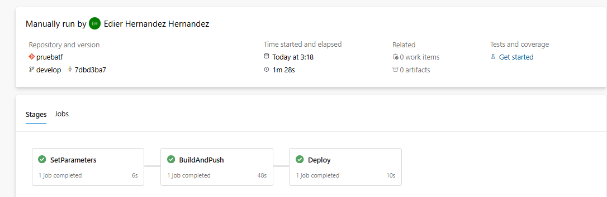
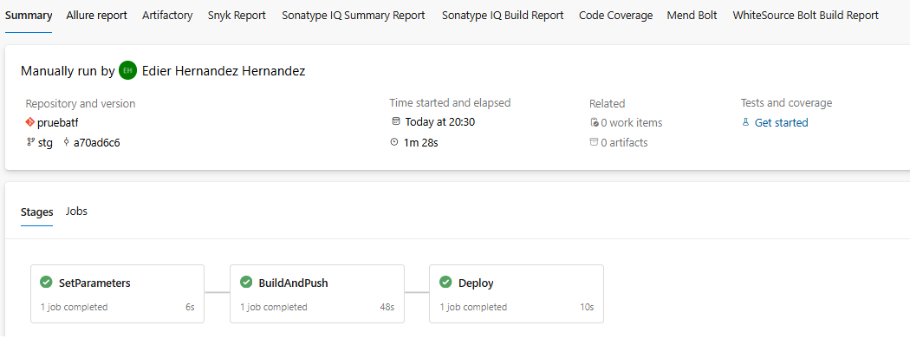
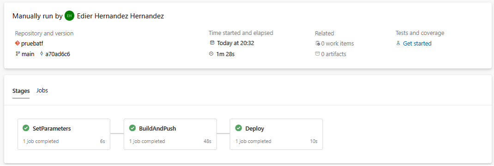

#Azure DevOps Pipeline para Despliegue en AWS ECS

Este pipeline de Azure DevOps permite la construcción, etiquetado y despliegue de una imagen Docker en Amazon Elastic Container Service (ECS) utilizando AWS Fargate.

📌 Configuración del Trigger

El pipeline se ejecuta automáticamente en los siguientes eventos:

Commits en las ramas main, develop y stg.

trigger:
  branches:
    include:
      - main
      - develop
      - stg

🔧 Variables de Entorno

Las variables de entorno son gestionadas por grupos de variables en Azure DevOps:

variables:
  - ${{ if eq(variables['Build.SourceBranchName'], 'develop') }}:
      - group: 'pruebatf-dev'
  - ${{ if eq(variables['Build.SourceBranchName'], 'stg') }}:
      - group: 'puebatf-Stg'
  - ${{ if eq(variables['Build.SourceBranchName'], 'main') }}:
      - group: 'puebatf-Prod'

Este grupo de variables nos permite desplegar por ambiente 
segun el grupo de variables: 

|Grupo de Variables|Ambiente en que despliega|
|--|--|
|pruebatf-dev|Desarrollo|
|pruebatf-stg|Stagin|
|pruebatf-Prod|Produccion |

📌 Etapas del Pipeline

1️⃣ SetParameters

Carga las variables de entorno necesarias para la ejecución del pipeline.

- stage: SetParameters
  jobs:
  - job: LoadParameters
    steps:
    - script: |
        echo "Cargando parámetros de despliegue..."
        echo "##vso[task.setvariable variable=aws_region]$(AWS_REGION)"
        echo "##vso[task.setvariable variable=aws_access_key_id]$(AWS_ACCESS_KEY_ID)"
        echo "##vso[task.setvariable variable=aws_secret_access_key]$(AWS_SECRET_ACCESS_KEY)"
        echo "##vso[task.setvariable variable=ecr_repository]$(ECR_REPOSITORY)"
      displayName: 'Set Environment and Region Variables'

2️⃣ BuildAndPush

Compila la imagen Docker y la sube a Amazon Elastic Container Registry (ECR).

- stage: BuildAndPush
  jobs:
  - job: BuildAndPushImage
    steps:
    - script: |
        echo "Autenticando en Amazon ECR..."
        aws ecr get-login-password --region $(aws_region) | docker login --username AWS --password-stdin $(aws_account_id).dkr.ecr.$(aws_region).amazonaws.com
      displayName: 'Login to Amazon ECR'

    - script: |
        echo "Construyendo y etiquetando imagen Docker..."
        docker build -t $(ecr_repository):latest .
        docker tag $(ecr_repository):latest $(aws_account_id).dkr.ecr.$(aws_region).amazonaws.com/$(ecr_repository):latest
      displayName: 'Build and Tag Docker Image'

    - script: |
        echo "Subiendo imagen a Amazon ECR..."
        docker push $(aws_account_id).dkr.ecr.$(aws_region).amazonaws.com/$(ecr_repository):latest
      displayName: 'Push Docker Image to Amazon ECR'

3️⃣ Deploy

Realiza el despliegue en AWS ECS con estrategias Rolling Update o Blue/Green.

- stage: Deploy  
  jobs:
  - job: DeployToAWS
    steps:
    - script: |
        echo "Registrando nueva definición de tarea ECS..."
        aws ecs register-task-definition \
          --family $(task_definition_family) \
          --execution-role-arn $(execution_role_arn) \
          --network-mode awsvpc \
          --requires-compatibilities FARGATE \
          --cpu "256" \
          --memory "512" \
          --container-definitions "[{\"name\":\"$(container_name)\",\"image\":\"$(aws_account_id).dkr.ecr.$(aws_region).amazonaws.com/$(ecr_repository):latest\",\"essential\":true, \"memory\":512, \"cpu\":256, \"portMappings\":[{\"containerPort\":80,\"hostPort\":80}]}]" \
          --task-role-arn $(task_role_arn)
      displayName: 'Register New Task Definition'

    - script: |
        if [ "$(deployment_strategy)" == "rolling" ]; then
          echo "Realizando Rolling Update..."
          aws ecs update-service --cluster $(cluster_name) --service $(service_name) --task-definition $(task_definition_family) --force-new-deployment
        elif [ "$(deployment_strategy)" == "blue-green" ]; then
          echo "Desplegando con Blue/Green usando AWS CodeDeploy..."
          aws deploy create-deployment \
            --application-name $(service_name)-app \
            --deployment-group-name $(service_name)-dg \
            --revision revisionType=AppSpecContent,appSpecContent="{\"version\":\"0.0\",\"resources\":[{\"TargetService\":{\"Type\":\"AWS::ECS::Service\",\"Properties\":{\"TaskDefinition\":\"$(task_definition_family)\",\"LoadBalancerInfo\":{\"ContainerName\":\"$(container_name)\",\"ContainerPort\":80}}}}]}"
        else
          echo "Estrategia no reconocida, aplicando Rolling Update por defecto."
          aws ecs update-service --cluster $(cluster_name) --service $(service_name) --task-definition $(task_definition_family) --force-new-deployment --desired-count 1
      displayName: 'Deploy to ECS Fargate'

✅ Evidencias del Despliegue 

- Ambiente Desarrollo

- Ambiente Stagin

- Ambiente Produccion

